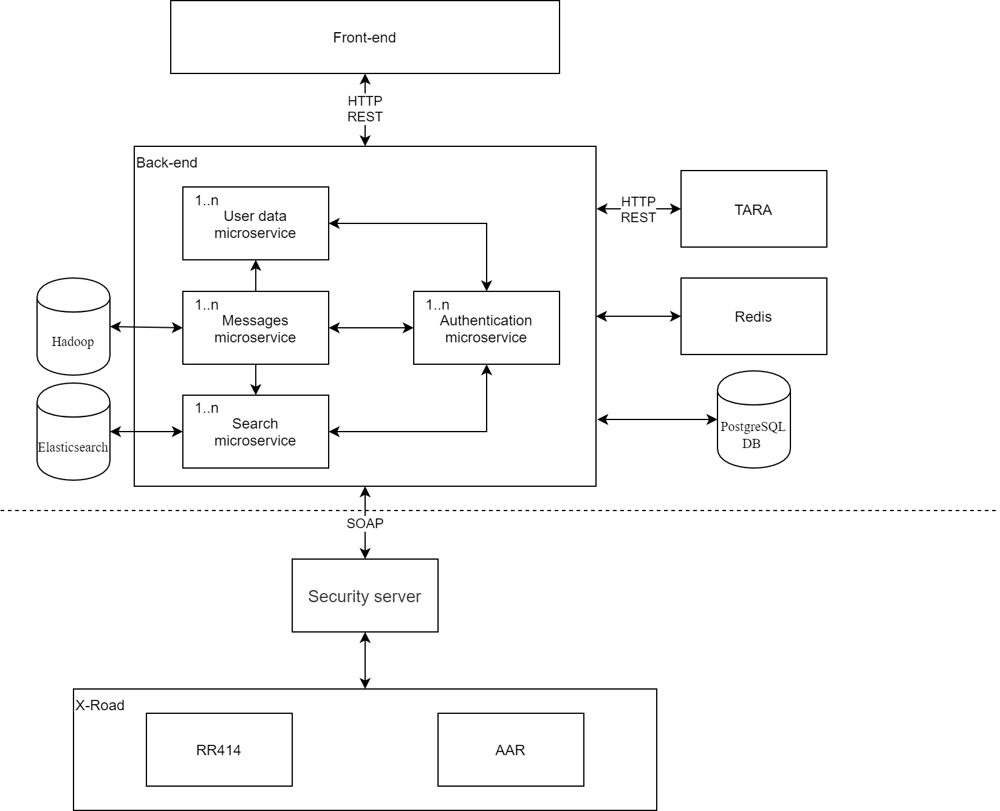

# Rakenduse 'Postkasti Teenus' paigaldusjuhend

## 1. Sissejuhatus

Selle dokumendi eesmärk on kirjeldada tehnilisi keskkonnanõudeid ja anda paigaldusjuhiseid **Postkasti Teenus** rakenduse paigaldamiseks ja integreeritud konfigureerimiseks. See rakendus on välja töötatud vastavalt ['Tarkvara arendus- ja hooldustööd II' riigihanke](https://riigihanked.riik.ee/rhr-web/#/procurement/1703912/general-info) proovitöö nõuetele ja [spetsifikatsioonile](https://riigihanked.riik.ee/rhr-web/#/procurement/1703912/documents/source-document?group=B&documentOldId=13329969).

Tegu on **täieliku** lahendusega, mis sisaldab:

- **Postkasti Teenus** rakendust  4 mikroteenuse komplektina ja eraldi esitluskihiga, pakitud Dockeri konteineritesse
- PostgreSQL andmebaasi, pakitud Dockeri konteinerisse
- NGinxi koormusjaoturit, pakitud Dockeri konteinerisse
- Redis vahemälu puhvrit, pakitud Dockeri konteinerisse
- ElasticSearch indekseerimise mootorit, pakitud Docker konteinerisse
- Hadoop HDFS jagatud failisüsteemi, pakitud Docker konteinerisse

_**Täielik** lahendus tähendab antud kontekstis seda, et lahenduse käivitamiseks ja proovimiseks ei ole tarvis mistahes täiendavaid komponente (nagu näiteks eraldi koormusjaotur, eraldi andmebaas vms) ja kõik rakenduse käivitamiseks on tarnitud käesoleva tarnega ning paigaldatav käesoleva juhendi järgi._

Kogu installimise ajal ehitatud kood pakitakse Dockeri konteineritesse ja installimise ajal kompileeritakse see automaatselt Dockeri koostamisskriptidega.

Teisisõnu, koodi installimine, käivitamine ja kasutamine ei vaja midagi muud kui seda, mis kuulub tarnitavasse paketti. Kõik vajalikud komponendid sisalduvad selles tarnes.

Vaikekonfiguratsioonis installib Docker:

- Kaks eksemplari iga mikroteenuse kohta **Postkasti Teenus** rakendusest
- Nginxi koormusjaoturi, et jagada koormus kahe instantsi vahel lihtsa round-robini koormusjaotuse printsiibi alusel
- PostgreSQL andmebaasi
- Hadoop HDFS klastri (2+1)
- Redis vahemälu klastri (2 õlga)
- ElasticSearch indekseerimise mootori

*Andmebaas ja koormuse jaotur on vaikimisi installitavad ühe eksemplari konfiguratsioonis, mis definitsiooni järgi teeb neist SPoF-i.*

*Tegu on teadliku valikuga, sest tegemist on siiski proovitööga. Nii andmebaasi, kui koormusjaoturi paigaldus mitmes instantsis toimub hõlpsasti konfiguratsiooni muutes - nii üks kui teine on võimelised töötama klastris minimaalse konfiguratsiooni muutmisega. Rakendus ise on karbist valmis olema ümber konfigureeritud, kasutamas connection-pool loogikat, toetamas mitme instantsilise andmbeaasi klastri konfiguratsiooni.*

*Siiski, taolise konfiguratsiooni tarnimine antud proovitöö raames oleks teinud paigalduse oluliselt keerulisemaks ja paigaldusmeeskonnalt lisatööd nõudvaks (kasvõi RR DNS kirjete loomise näol koormusjaoturi jaoks jne.). Meie eesmärk antud prooviülesanne raames oli siiski tarnida lahendus, mis pidades silmas kõiki kõrgkäideldavuse ja koormuse skaleeritavuse nõudmisi, oleks ka automaatselt või absoluutselt minimaalsete interventsioonidega ülesse ehitatav ja käivitatav. Nurgakiviks antud otsuse juures oli aspekt, et Pakkujana ei ole meil võimalust osutada abi paigaldamises, seega kuivõrd riskida sellega, et paigaldus nurjub mõnes etapis, on mõistlikum paigaldusloogikat lihtsamana hoida.*

*Tootmiskonfiguratsioonis kindlasti konfigureeriksime andmebaasi ja koormusjaoturi mitmeinstantsilise klastri konfiguratsioonis. Kuid usume et nii meie, kui ka lugupeetud kasutaja mõistab, et taolise konfiguratsiooni tarnimine oleks nõudnud lugupeetud kasutajalt täiendavaid ja ebavajalike konfigureerimise samme keskkonna poolt ning teinud oluliselt rohkem ajanõudvamaks rakenduse ülesse ehitamise.*

*Kinnitame omalt poolt, et rakenduse disain on ülesse ehitatud täies mahus, silmas pidades mitme instantsilise koormusjaoturi ja mitme instantsilise andmebaasi konfiguratsiooni kasutamist tootmiskonfiguratsioonis.*

**TLS**

Rakendus tarnitakse koos sisseehitatud (konfiguratsioonis seadistatav) self-signed CA sertifikaadi ja võtmega.
Rakenduse üles ehitamisel, teostab ehitusmehhanism kahte asja:

- Lisab iga konteineri puhul, mainitud self-signed CA sertifikaadi trusted CA'ks.
- Genereerib iga konteineri jaoks oma sertifikaadi ja RSA võtme (iga konteineri jaoks ehk kaks instantsi samast teenusest omavad erinevaid sertifikaate ja erinevaid võtmeid) ja allkirjastab antud sertifikaati CA sertifikaadiga.

Kõik see toimub automaatselt projekti üles ehitamisel.
Osade komponentide puhul on realiseeritud kliendisertifikaadi alusel autentimine (kahesuunaline TLS).

Kohtades, kus on konfigureeritud kahesuunaline TLS, kontrollib vastuvõttev komponent kliendisertifikaadi olemasolu ja selle sertifikaadi allkirjastatuse fakti ülalmainitud CA poolt. Juhul, kui sertifikaat on allkirjastatud usaldatud CA poolt (antud juhul siis ülalmainitud self-signed CA poolt) - ühendus lubatakse, vastasel juhul, ühendust ei toimu.
Oluline on mainida, et kontrollitakse ainult usaldatud CA poolt allkirjastatuse fakti ja näiteks CN ja DN ei ole kontrolli skoobis. Kindlasti on võimalik skoopi laiendada CN ja DN kontrollide suunas, kuid oleme eeldanud, et oskusliku kliendisertifikaatide kasutamise all, on lugupeetud Hankija mõelnud just usaldatud CA poolt allkirjastamise kontrolli printsiipi.  

Allpool on toodud võrdlev tabel, koos argumentatsiooniga, kus on kasutatud ja kus mitte, kahesuunalist TLS autentimist.

|Komponent|TLS|CLIENT CERT|Selgitus|
|--|--|--|--|
|Mikroteenused|Jah|Jah|Kõik mikroteenused eeldavad kahesuunalist TLS-i suhtlemises ehk kliendisertifikaadiga autentimist.|
|ElasticSearch|Jah|Jah|Kasutusele on võetud AWS-i (on-prem) ElasticSearch port, kus on kliendisertifikaadiga autentimine sisse lülitatud. Upstream ElasticSearch karbist ei toeta kliendisertifikaatidega autentimist.|
|SIVA|Jah|Jah|SIVA on publitseeritud Nginxi taga ning ligipääsemiseks on tarvis kliendisertifikaadiga autentimist.|
|Redis|Jah|Jah|Redis eeldab kahesuunalist TLS-i suhtlemises ehk kliendisertifikaadiga autentimist.|
|Hadoop|Jah|Ei|Hadoop toetab kliendisertifikaadiga autentimist, kuid selleks on vajalik eraldi Kerberose instantsi paigaldus ja selle haldus ning sünkroniseerimine. Prooviülesande raames meie hinnangul oleks see ehk teinud rakenduse automatiseeritud üles ehitamise ebavajalikult keerukaks, suure riskiga ebaõnnestuda, kui lugupeetud Hankija hakkab seda üles ehitama. Rohkem detaile Hadoopi [ametlikust dokumentatsioonist](https://hadoop.apache.org/docs/stable/hadoop-project-dist/hadoop-common/SecureMode.html#Data_Encryption_on_HTTP). Sel põhjusel on Hadoop jäetud vaid TLS-iga turvatuks.|
|PostgreSQL|Jah|Ei|PostgreSQL kliendisertifikaadiga autentimist toetab, kuid taaskord selle sisse lülitamine vajab eraldi keemiat sertifikaatide CN-idega ja selle sisse lülitamine esindab väga suurt riski, et buildi protsess lihtsalt rikneb. Seetõttu ei pruugi saada prooviülesannet käima ja meil puudub võimalus ad-hoc aidata. Sel põhjusel otsustasime, et töökindlam ja ohutum oleks jäta PostgreSQL server palja TLS-i peale jooksma.|


**CI/CD**

Rakendus tarnitakse koos automaatse CI / CD konfiguratsiooniga (Jenkins) ning selle saab automaatselt ehitada ja arenduskeskkonda paigaldada. Jenkinsi käsufail on koodipuu ülemisel tasemel (samal tasemel nagu see fail).

## 2. Keskkonna ülevaade



Ülaltoodud diagramm kirjeldab rakenduse 'Postkasti Teenus' keskkonna integreeritud seadistust.

## 3. Eeltingimused paigalduseks

- Lähtekood koos Docker compose juhiste failiga on lahti pakitud kettale.

- Paigalduseks kasutatava serveri operatsiooni süsteem on Ubuntu 18.04 (või kõrgem) ja jookseb x86 platvormil. (Alternatiivsed platvormid on toetatud, kuid antud konkreetne paigaldusjuhend on kirjutatud Ubuntu 18.04 ja x86 platvormile)

- **Paigalduseks kasutatava serveri vaba (s.t. peale operatsioonisüsteemi jms.) operatiivmälu maht on vähemalt 16 Gb. Me tungivalt ei soovita kasutada masinat väiksema operatiivmälu mahuga: komponendid, millest koosneb lahendus on küll väga vastupidavad koormuse mõistes (nn. enterprise grade), kuid seeläbi ka üsna suurte minimaalsete nõudmistega. Parimaks kasutuskogemuseks, me soovitaksime kasutada masinat vähemalt 24 Gb vaba operatiivmäluga.**

- Uuendage oma olemasolevat pakettide teeki:

`sudo apt update`

- Installige mõned eeltingimuslikud paketid, mis võimaldavad apt-il pakette HTTP-s kasutada:

`sudo apt install apt-transport-https ca-certificates curl software-properties-common`

- Lisage oma süsteemi GPG-võti ametliku Dockeri hoidla jaoks:

`curl -fsSL https://download.docker.com/linux/ubuntu/gpg | sudo apt-key add -`

- Lisage Dockeri hoidla APT-i allikate hulka:

`sudo add-apt-repository "deb [arch=amd64] https://download.docker.com/linux/ubuntu bionic stable"`

- Uuendatud repost värskendage pakettide andmebaasi Dockeri pakettidega:

`sudo apt update`

- Veenduge, et installite vaikimisi Ubuntu repo asemel Dockeri repost:

`apt-cache policy docker-ce`

- Eelmise punkti täitmiseks kontrollige selle väljundit. Väljund peaks välja nägema sarnaselt allolevaga, kuigi Dockeri versiooninumber võib olla erinev:

```

docker-ce:

Installed: (none)

Candidate: 18.03.1~ce~3-0~ubuntu

Version table:

18.03.1~ce~3-0~ubuntu 500

500 https://download.docker.com/linux/ubuntu bionic/stable amd64 Packages

```

- Serveris installeeritud Docker Compose versioon peab olema vähemalt 1.25.4 (või kõrgem):

- Installi Docker:

`sudo apt-get install docker-ce`

- Dockeri compose-i skriptide paigaldus:

`sudo curl -L "https://github.com/docker/compose/releases/download/1.25.4/docker-compose-$(uname -s)-$(uname -m)" -o /usr/local/bin/docker-compose`

`sudo chmod +x /usr/local/bin/docker-compose`

- Installi openjdk 11 (et luua mikroteenuseid):

`sudo apt install openjdk-11-jdk`

- Installi git (lähtekoodi saamiseks repost):

`sudo apt install git`

- Installi openssl:

`sudo apt install openssl


## 4. Konfiguratsiooni ettevalmistus
*Enamus  tarnitavates konfiguratsiooni failides toodud vaikeväärtustest, reaalses elus ei vaja muutmise. Need on nn. "safe-defaults". Väärtused, mis kindlasti vajavad üle vaatamise, kuna tegu on keskkonna spetsiifiliste väärtustega, on toodud rasvases kirjas allpool.*

- Avage konfiguratsiooni fail [*backend/docker-compose.yml*](https://10.0.9.217/projects/RH6/repos/rh6/browse/backend/docker-compose.yml):

  - Seadistage Swagger konfiguratsiooni parameteetrid

  - Seadistage Postgres andmebaasi konfiguratsiooni parameetrid

  - Seadistage Redis konfiguratsiooni parameetrid

  - Seadistage Elasticsearch konfiguratsiooni parameetrid

  - Seadistage rakenduse mikroteenuste konfiguratsioon

- Avage konfiguratsiooni fail [*front/docker-compose.yml*](https://10.0.9.217/projects/RH6/repos/rh6/browse/front/docker-compose.yml):

  - **Seadistage nginx konfiguratsiooni parameetrid**

  - Seadistage frontend konfiguratsiooni parameteetrid

    Abiks Vue.JS tootja raamistiku [juhised]    (https://cli.vuejs.org/config/).

- Avage konfiguratsiooni fail [*backend/mailbox-service/src/main/resources/application.yml*](https://10.0.9.217/projects/RH6/repos/rh6/browse/backend/mailbox-service/src/main/resources/application.yml):

  - Seadistage andmebaasi ühenduse parameetrid

- Seadistage koormusjaoturi parameetrid

  - Logimise konfiguratsioon

  - Avage konfiguratsiooni fail  [*backend/user-service/src/main/resources/application.yml*](https://10.0.9.217/projects/RH6/repos/rh6/browse/backend/user-service/src/main/resources/application.yml):

  - Seadistage andmebaasi ühenduse parameetrid

  - Puhvermälu konfiguratsioon (Сaffein)

  - Logimise konfiguratsioon

- Avage konfiguratsiooni fail [*backend/auth-service/src/main/resources/application.yml*](https://10.0.9.217/projects/RH6/repos/rh6/browse/backend/auth-service/src/main/resources/application.yml):

  - Seadistage andmebaasi ühenduse parameetrid

  - Seadistage OAuth2 turvaparameteetrid

  - **TARA teenuse konfiguratsioon**

  - Logimise konfiguratsioon

- Avage konfiguratsiooni fail [*backend/search-service/src/main/resources/application.yml*](https://10.0.9.217/projects/RH6/repos/rh6/browse/backend/search-service/src/main/resources/application.yml):

  - Logimise konfiguratsioon

  **- Seadistage TARA raamistikuga suhtlemiseks vajalikud keskkonnamuutujad.**

Allpool leitavad autentimisteenuse [*backend/docker-compose.yml*](https://10.0.9.217/projects/RH6/repos/rh6/browse/backend/docker-compose.yml)  keskkonnamuutujaid kasutatakse Tara teenusega suhtlemiseks. Tagasisuunamise (callback) URL tuleb seada selle serveri avaliku IP-aadressiks, kus paigaldamine toimub. Meie arenduskeskkonna paigaldatavad väärtused on toodud allpool:

- SPRING_SECURITY_OAUTH2_CLIENT_REGISTRATION_TARA_CLIENT_ID=ru-int-ria-gov-inbox-sample2

- SPRING_SECURITY_OAUTH2_CLIENT_REGISTRATION_TARA_CLIENT_SECRET=aFTFC4h-nnwxKTAZe9tfmi3H

- SPRING_SECURITY_OAUTH2_CLIENT_REGISTRATION_TARA_REDIRECT_URI=https://10.1.19.35/authorize/taara-callback

## 5. Paigaldusprotsess

Täitke järgmised sammud **Postkasti Teenus** teenuse paigaldamiseks.

**`sudo` käsklus on vajalik allolevateks sammudeks.**

_(root ligipääsu tarvis ei ole, piisab dockeri kasutajana käivitamisest)_

- Kloonige repositaariumit lähtekoodiga:  

```
git clone https://10.0.9.217/scm/rh6/rh6.git
```

- Looge sertifikaadid kõikide mikroteenuste jaoks:

```
bash ./generate_certificates.sh
```

- Koostage Postgres andmebaasi kujutis:

```
sudo docker build . -t postgres_database -f infra/db/Dockerfile-introduct --build-arg CERT_FILE=infra/db/cert.crt --build-arg KEY_FILE=infra/db/cert.key

```

- Koostage jar paketid kõigi **Postkasti Teenus** rakenduse mikroteenuste jaoks:

```
cd backend

./mvnw clean

./mvnw -Pria clean install

cd ..
```

- Koostage Dockeri kujutised kõigi **Postkasti Teenus** rakenduse mikroteenuste jaoks:

```

sudo docker build --build-arg JAR_FILE=backend/mailbox-service/target/mailbox-service.jar -t mailbox-service .

sudo docker build --build-arg JAR_FILE=backend/user-service/target/user-service.jar -t user-service .

sudo docker build --build-arg JAR_FILE=backend/auth-service/target/auth-service.jar -t auth-service .

sudo docker build --build-arg JAR_FILE=backend/search-service/target/search-service.jar -t search-service .

```

- Käivitage mikroteenuste paigaldus koos PostgresSQLi, Elasticsearchi, Redise ja Hadoop-iga:

```
sudo docker-compose -p rh6_deploy -f backend/docker-compose.yml  up -d
```

- Koostage Dockeri kujutis esitluskihi jaoks:

```
cd fronted
sudo docker build -f Dockerfile-local -t mailbox-frontend
cd ..
```

- Koostage Siva veebirakendus ja Dockeri kujutis selle jaoks:

```
sudo bash ./infra/siva/build.sh

sudo docker-compose -p rh6_deploy -f infra/siva/docker-compose.yml up -d

```

- Käivitage esitluskihi paigaldus (scale faktor näitab mitu instantsi tuleb käivitada):

```
sudo docker-compose -p rh6_deploy -f front/docker-compose.yml  up -d
```

- Käivitage Nginx koormusjaotur: 

`sudo docker-compose -p rh6_deploy -f infra/lb/docker-compose.yml  up -d`

## 6. Paigaldusjärgne kontroll

Kui paigaldus on lõpule jõudnud, siis nõuetekohase paigalduse tagamiseks kontrollige allasuva käsuga, et kas kõik konteinerid on üles tulnud ning töötavad korrapäraselt. Protsesside käivitumiseks ja jooksma hakkamiseks kulub umbes 30–40 sekundit.

`docker ps -a`

Avage rakenduse kasutajaliides avades brauserist severi IP aadress, logige sisse ja proovige teha toiminguid.

## 7. Ühiktestide käivitus

**Mikroteenuste ühiktestide käivitamiseks**:

- Kloonige viimast versiooni mikroteenuste lähtekoodist git mailbox-service repositaariumust ning vahetage kataloog:

_optsionaalne samm, viimase versiooni kättesaamiseks - internetiühenduse puudumisel või piiratud ühenduse olemasolul, lihtsalt vahetage kataloog, käsuga "cd backend" - vajalik lähtekood on Teile tarnitud käesoleva arhiiviga_

```

git clone https://10.0.9.217/scm/rh6/rh6.git


cd backend

```

- Käivita testid:

`./mvnw test`

**Esitluskihi ühiktestide käivitamiseks**:

- Kloonige viimast versiooni esitluskihi lähtekoodist git front repositaariumust ning vahetage kataloog:

_optsionaalne samm, viimase versiooni kättesaamiseks - internetiühenduse puudumisel või piiratud ühenduse olemasolul, lihtsalt vahetage kataloog, käsuga "cd front" - vajalik lähtekood on Teile tarnitud käesoleva arhiiviga_

```

git clone https://10.0.9.217/scm/rh6/rh6.git

cd front

```

- Seadista projekt:

```

npm install

```

- Käivita ühiktestid:

```

npm run test:unit

```

## 8. Automaattestide käivitus (Selenium)

Automaattestid on tarnitud selle tarne osana ja nende käivitamine on kirjeldatud eraldi failis: *[ria-qa/README.md](../ria-qa/README.md)*.

Selenium automaattestide käivitamiseks, palume pöörduda ülalmainitud juhendi poole.

Selenium automaattestid antud projektile on kättesaadavad ka [repositaariumist](https://10.0.9.217/projects/RH6/repos/rh6/browse/ria_qa/).


## 9. Jenkins keskkond

CI/CD pipeline'idega mängimiseks võib kasutada ka Jenkins CI/CD testkeskkonda (eraldi keskkond antud prooviülesanne jaoks), mis ehitab [testkeskkonnas](https://10.1.19.35/) asuvat rakendust.

Jenkins keskkonnad:

- Mikroteenuste CI/CD pipeline on leitav [siin](https://rh6-jenkins-01.dev.riaint.ee/job/rh6_backend/).

- Esitluskihi CI/CD pipeline on leitav [siin](https://rh6-jenkins-01.dev.riaint.ee/job/rh6_front/).

- Nginxi laadur CI/CD pipeline on leitav [siin](https://rh6-jenkins-01.dev.riaint.ee/job/rh6_lb/).

- Siva CI/CD pipeline on leitav [siin](https://rh6-jenkins-01.dev.riaint.ee/job/rh6_lb/).

- Automaattestide käivitamiseks mõeldud CI/CD pipeline on leitav [siin](https://rh6-jenkins-01.dev.riaint.ee/job/Run%20qa%20tests/)