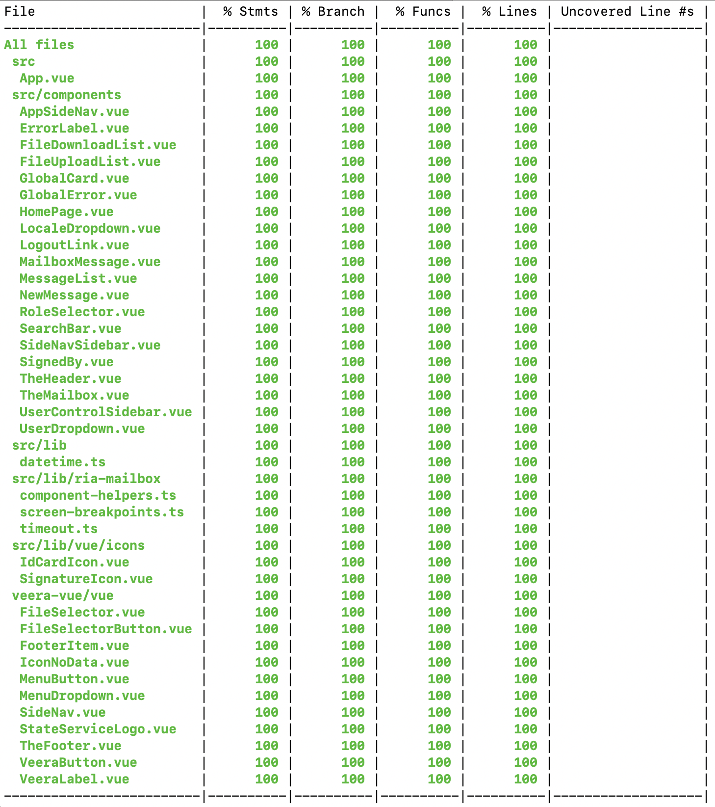

# Nõuete checklist

Käesolevas dokumendis toome välja kõik hankes esitatud nõuded proovitööle, nende täitmise kinnituse ja ühtlasi ka täitmise üksikasjad. Juhul, kui mõni nõue ei ole täidetud täies mahus, toome välja ka argumentatsiooni, et miks see nii on.

*Lugupeetud Hankija, sooviksime eraldi välja tuua ka järgmise aspekti: Pakkujal oli antud proovitöö teostamiseks aega rohkem kui tarvis, eriti arvestades asjaolu, et hanke väljakuulutamise hetkeks oli Pakkujal olemas ca 75 % proovitöö mahust, mis oli varasemate hangete raames teostatud.*

*Ühtlasi rõhutame, et Pakkuja on ülimotiveeritud antud hanke võitmiseks ja seetõttu oleme väga tõsiselt suhtunud Hankija poolt esitatud nõudmistesse. Kinnitame, et Pakkujal oli piisavalt aega, ressurssi ja motivatsiooni, et täita kõik Hankija poolt esitatud nõudmised ja oleme selleks tutvunud põhjalikult etteantud nõuete nimekirjaga.*

*Siiski väga range kontrolli puhul, võib Hankija leida mõne nõude, mis on täidetud 90-95% ulatuses. Täpsustame, et see 5-10% allesjäänust ei ole tingitud aja, ressursi, motivatsiooni või oskuste puudumisest vaid reeglina on seal kindel põhjus taga. Kas see põhjus on mõjukas või mitte, jätame loomulikult Hankija otsustada, kuid siiski soovime omada võimalust tuua välja endapoolseid argumente. Selleks on ka antud dokument loodud, kommenteerimaks detailselt igat etteantud nõuet ja selle teostust. Nagu eelpool kinnitatud, siis oleme omanud piisavalt aega, oskust ja siirast tahet, et väga detailselt ja tõsiselt suhtuda Hankija poolt esitatud nõuetesse.*

## Proovitöö kohta esitatud nõudmised

**Mikroteenuste arhitektuur**

> - [x] Pakkujal tuleb realiseerida mikroteenuste arhitektuuri kasutav lahendus.

Teostatud lahendus põhineb Netflix OSS ning Spring Cloud tehnoloogilistel teekidel ning tarnib neli selgelt, funktsionaalselt ja loogiliselt eraldatud mikroteenust, milleks on:

|Mikroteenus|Kirjeldus|
|--|--|
|User data|Kasutaja andmete mikroteenus.|
|Messages|Sõnumite mikroteenus.|
|Authentication|Autentimise mikroteenus.|
|Search|Otsingu mikroteenus.|

### 1. API põhisus

> - [x] 1.1. Peab olema realiseeritud vähemalt üks api põhine teenus  (hinnatakse). Loodud API peab toetama järgmiseid tegevusi:
> - [x] 1.1.1. Õnnestunud päringule vastamine  (hinnatakse);
> - [x] 1.1.2. Vigasele päringule veateatega vastamine  (hinnatakse).
> - [x] 1.2. Peab kasutama REST/JSON formaati  (hinnatakse).

Lahendus tarnib täisfunktsionaalse administraatori API liidese, mille kaudu on administraatoril võimalik ennast autentida ning importida ja eksportida sõnumeid postkasti, k.a manuste import / eksport, k.a digitaalselt signeeritud manuste import / eksport. Rohkem informatsiooni antud liidesest, selle käitumisest ning kasutusest on leitav eraldi [liideste dokumentatsioonist](API.md), [OpenAPI formaadis administraatori liideste spetisifikatsioonist](https://10.1.19.35/admin/data/swagger/) ja [OpenAPI formaadis süsteemi liideste spetisifikatsioonist](https://10.1.19.35/api/v1/swagger/). 
API liidesed on teostatud REST/JSON protokollil.

### 2. UX kasutusoskus

> - [x] 2.1. Lahendus peab kasutama Veera raamistikku, mis on kättesaadav aadressilt: [https://koodivaramu.eesti.ee/veebiraamistik/veera](https://koodivaramu.eesti.ee/veebiraamistik/veera)  (hinnatakse).

Lahenduse UX on üles ehitatud VEERA raamistikul täies mahus, sealjuures väga rangelt jälgides VEERA raamistiku nõudeid ja elemente.
Tarnitud proovitöö on implementeeritud Veera raamistikus Vue.JS-is, milles oleme väga rangelt jälginud Veera raamistiku stiili juhtnööre. Antud aspekt on meie arvamusel olemasolevate kolmanda osapoole implementatsioonide probleem ja põhjuseks, et miks oleme oma implementatsiooni kätte võtnud, selle asemel, et vahetada front-end tehnoloogiat ja kasutada mõnda olemasolevat implementatsiooni.

### 3. X-tee kasutamise oskus

> - [x] **NB! Pakkuja võib kasutada x-teega suhtluseks oma valmisteeke kui need on olemas.**

Pakkuja on kasutusele võtnud Nortali poolt teostatud [J-Road kliendi implementatsiooni](https://github.com/nortal/j-road) X-Tee'ga suhtlemiseks. Pakkuja on arvamusel, et *jalgratta leiutamine* antud nõude täitmisel ei oleks põhjendatud.

> - [x] 3.1. Lahenduses peab olema realiseeritud kasutajale rolli omistamine AAR andmekogust  (hinnatakse)

Kasutaja sisselogimisel, peale TARA poolt õnnestunud sisselogimise teate saamist, hangib süsteem RIA AAR test serverist kasutajale omistatud rolle. Juhul, kui kasutajal on rohkem kui üks roll, pakutakse kasutajale võimalust valida soovitud roll nimekirjast.

Kontseptsiooni testimiseks pakume sisselogimist [RIA test keskkonda](https://10.1.19.35/) näiteks Smart-ID isikukoodiga 10101010005 või Luminor panga pangalingist kasutajatunnusega 111111 ja digivõtme koodiga 9999. Nendele isikutele on RIA test AAR-is omistatud mitu erinevat rolli.

**NB! Rolli valides jätkab kasutaja tööd selles rollis seansi lõpuni. Rolli vahetuseks peab kasutaja välja logima ning seejärel uuesti sisse logima. (*Jah, ebamugav, kuid antud käitumise näol on tegu teadliku lihtsustusega, sest tegemist on siiski proovitööga. Päris toote puhul me suure tõenäosusega provisioneeriksime rolli vahetuse mehhanismi välja logimiseta.*)**

> - [x] 3.2. Lahenduses peab olema realiseeritud autenditud kasutaja andmete kuvamine rahvastikuregistri andmekogu andmestikult  (hinnatakse);

Peale edukat sisselogimist ja rolli valikut (juhul, kui kasutajal on mitu rolli AAR-is nagu eelpool mainitud), hangime kasutaja andmeid RR414 teenusest (RIA testserverist) ja kuvame need andmed kasutaja andmete plokis (nähtav, kui klikata kasutaja isikukoodile paremas ülemises nurgas).

Kuvatakse:
- Kasutaja ees ja perekonnanimi
- Kasutaja sünnikuupäev
- Kasutaja elukoha aadress

Juhul, kui kasutaja on valinud mõne esindusrolli (s.t. mitte iseennast), kuvatakse ploki alumises osas isik/registrikood isikust, keda kasutaja esindab. Heameelega tahaksime kuvada ka selle isiku detailsemaid andmeid, kuid kahjuks on enamasti tegu juriidiliste isikutega ja selle andmete kuvamine eeldaks äriregistri X-Tee teenustele ligipääsu, mida meil paraku antud prooviülesande teostamise raames ei ole.

> - [x] 3.2.1. Antud funktsionaalsus peab olema lahendatud koodis  (hinnatakse);

Koodis lahendatud.
X-Tee koodiosasid võib uurida kaustast [backend/user-service/src/main/java/tech/introduct/mailbox/xroad](https://10.0.9.217/projects/RH6/repos/rh6/browse/backend/user-service/src/main/java/tech/introduct/mailbox/xroad/)

> - [x] 3.2.2. Kasutatud koodiosa peab olema dokumenteeritud piisavalt, et saaks veenduda X-tee päringu kasutamise sisulises oskuses  (hinnatakse);

Koodiosad on täies mahus kommenteeritud näitamaks X-Tee pärimise kohtades olulisemaid momente. Muus osas on kood jäetud võimalikult self-explanatory'ks, et ka täiendavate kommentaarideta, oleks ta lihtsasti loetav ja arusaadav.
X-Tee koodiosasid võib uurida kaustast: [backend/user-service/src/main/java/tech/introduct/mailbox/xroad](https://10.0.9.217/projects/RH6/repos/rh6/browse/backend/user-service/src/main/java/tech/introduct/mailbox/xroad/).
Koodi kommentaaride näidetega saab tutvuda näiteks [siin](https://10.0.9.217/projects/RH6/repos/rh6/browse/backend/user-service/src/main/java/tech/introduct/mailbox/xroad/XRoadConfig.java).

> - [x] 3.2.3. Lahendus peab realiseerima veasitusatsioonide halduse (näiteks vale/puuduliku sisendiga päring, õiguste puudumine päringu tegemiseks x-teel, andmekogu poolt ei tagastata vastust või ei saada andmekoguga ühendust vms.)  (hinnatakse).

Lahendus on täies mahus testitud pakkuja kvaliteedimeeskonna poolt veasituatsioonidele seoses sõltuvustega.
Rakendus on kinnitatud õigesti töötlemas veasituatsioone.
Allpool toome välja oodatud ja testitud tulemid.

Eraldi toome välja, et definitsioon "maas", ei tähenda täielikku teenuse maasolekut, **vaid tähendab ja võib tähendada** teenuse mitte vastamist seatud timeout'i ajal. Testimise ajal on kunstlikult tekitatud olukordi timeout'iga päringu ebaõnnestumisteks.

|Vea olukord|Oodatud käitumine|
|--|--|
|AAR on maas|Kasutajale lubatakse sisselogimine, kuid rollide valikut ei pakuta ja kuvatakse veateade, et AAR on maas ning seetõttu ei ole tal võimalik valida rolli ja saab töötada vaid enda rollis, ilma esindusõiguse valimiseta.|
|RR414 on maas või ei vasta, või mistahes muu viga v.a. isiku mitte leidmine|Kuvatakse veateade, et Rahvastikuregister on maas, edasist kasutamist ei lubata, sest RR-i toimimine on teenuse toimimise vaatenurgast kriitiline (me ei suuda kuvada sõnumi saatja andmeid ja ei suuda verifitseerida saaja andmeid).|
|RR414 ei leia isikut|Kuvatakse veateade, et Rahvastikuregistrist isiku leidmine ei õnnestunud, edasist kasutamist ei lubata, sest RR-i toimimine on teenuse toimimise vaatenurgast kriitiline (ei suuda kuvada sõnumi saatja andmeid ja ei suuda verifitseerida saaja andmeid).|
|Mikroteenuse instants on maas|Koormusjaotur lülitab ümber toimiva instantsi peale. Sõltuvalt olukorrast võib võtta aega kuni 10 sekundit (koormusjaoturi seadistust timeout-i osas võib vähendada). Sessiooni andmed säilivad, s.h. poolik töö jms.|
|TARA on maas|Süsteem on kasutuskõlbmatu sisse logimata kasutajate jaoks, sest neid suunatakse koheselt TARA poole. Sisse loginud kasutajate jaoks ei muutu mitte midagi - töö jätkub standartses režiimis.|
|SIVA on maas|Digitaalselt signeeritud sõnumite puhul kuvatakse kasutajale teade, et sõnum on digitaalselt signeeritud, kuid allkirja kehtivust ja allkirjastajat ei ole võimalik kontrollida, sest verifitseerimise teenus on maas. Allkirjastaja andmeid ei kuvata.|

### 4. Sessioonihalduse kasutamine

> - [x] 4.1. Lahenduses tuleb seada kasutajasessioonile kehtivusaeg, see peab olema konfigureeritav väärtus (konfigureerimiskohad tuleb viidata)  (hinnatakse).

Sessiooni elupikkus määratakse auth-service mikroteenuse konfiguratsiooni failis [application.yml](https://10.0.9.217/projects/RH6/repos/rh6/browse/backend/auth-service/src/main/resources/application.yml), parameetris `spring/session/timeout`.
Alternatiivselt võib sessiooni pikkust määrata ka projekti ülesehitamise ajal, seades ümbruskonna muutujat `spring.session.timeout`.
Selle vaikeväärtus on `15 minutit`.
Vt. lähemalt repositooriumist: [backend/auth-service/src/main/resources/application.yml](https://10.0.9.217/projects/RH6/repos/rh6/browse/backend/auth-service/src/main/resources/application.yml)

> - [x] 4.2. Sessioon peab olema üle kõigi komponentide termineeritud kasutaja väljalogimisel  (hinnatakse).

Sessiooni hoitakse REDIS-es ja seda haldab autentimise mikroteenus. Kasutaja väljalogimisel sessioon termineeritakse.

Sessiooni timeout'i määrab autentimise mikroteenus REDIS-esse sessiooni propageerimisel. Kui timeout kukub, siis REDIS eemaldab endalt automaatselt sessiooni ja seeläbi ei ole sessioon enam kellelegi kättesaadav.
Kõik teenused sessiooni token-i saamisel pöörduvad autentimise mikroteenuse poole selle valideerimiseks.
Kõike ülaltoodut arvesse võttes, siis sessiooni hoitakse ühes kohas, seega üks kord sessiooni lõpetades, on ta lõpetatud igal pool.

### 5. Kõrgkäideldavus

> - [x] 5.1. Lahenduses peab olema realiseeritud rakenduskihi kõrgkäideldavus mis tähendab, et autenditud kasutaja lülitatakse automaatselt ümber toimivale õlale, tema sessiooniinfo ja rakendusse laetud andmed säiluvad rakenduskihi komponendi riknemisel  (hinnatakse).

Lahendus realiseerub täismahus rakenduskihi kõrgkäideldavuse.
Andmed kasutaja sessiooni kohta säilitatakse REDIS-e klastris. (N õlga, vaikekonfiguratsioonis N=2) Kõik rakenduskihi arendatud komponendid on arendatud stateless printsiipi alusel ehk mistahes andmed kasutaja sessiooni kohta võetakse REDIS-e klastrist.
Rakenduskihi komponendi riknemist on testitud pakkuja kvaliteedikontrolli meeskonna poolt: rakenduskomponendi riknemisel [kas ei ole kättesaadav või ei vasta teatud ajavahemiku (timeout) jooksul - testitud on mõlemat] Nginx koormusjaotur lülitub automaatselt ümber toimivale teenuse instantsile - sessioon siinjuures säilib täies mahus koos andmetega. Lõppkasutaja ei tunne muud, kui mõnesekundilist viidet, mida Nginx koormusjaotur vajab õla mittetoimivaks tunnistamiseks (juhul, kui see ei ole juba tehtud - testitud on stsenaarium kus koormusjaotur alles avastab õla mittetoimimist): sessioon, andmed ja sessiooni seis säilivad.

Allolevas tabelis on toodud vaikekonfiguratsioonis (projekti ehitamise ajal võib N-i määrata mistahes numbrile) tarnitavate rakenduskihi komponentide seis:

|Komponent|HA ?|N (õlgade arv)|Selgitus|
|--|--|--|--|
|Mikroteenused|Jah|2|Mikroteenused tarnitakse vaikimisi N=2 konfiguratsioonis. N võib olla projekti ehituse ajal seadistatud mistahes väärtusele. (vt. detailselt [Paigaldusjuhendist](INSTALL.md)|
|Redis|Jah|2|REDIS tarnitakse kahe õla klastri konfiguratsioonis. (active-passive)|
|Hadoop|Jah|1+2|Hadoop tarnitakse 1 namenode + 2 datanode konfiguratsioonis.|
|PostgreSQL|Ei (*)|1|PostgreSQL tarnitakse vaikimisi ühe õla konfiguratsioonis. (vt. selgitus)|
|Nginx|Ei (*)|1|Nginx tarnitakse vaikimisi ühe õla konfiguratsioonis. (vt. selgitus)|
|ElasticSearch|Ei (*)|1|Elasticsearch tarnitakse vaikimisi ühe õla konfiguratsioonis. (vt. selgitus)|

(*) - *Nii Nginx, ElasticSearch kui PostgreSQL on antud prooviülesande puhul tarnitud ühe õla konfiguratsioonis. Tegemist ei ole meie laiskusega või meie oskamatusega neid komponente konfigureerida ja klasterdada. Põhipõhjus seisneb selles, et nii PostgreSQL kui Nginx puhul, arvestades muud konfiguratsiooni keerukust (TLS, kliendisertifikaadid) ja täisautomatiseeritud projekti ehitusprotsessi, nende kolme komponendi klasterdamine oleks tahes-tahtmata oluliselt suurendanud riski, et projekt ei lähe esimesest katsest käima ja ei ehitu üles (RIA teise keskkonna paigaldusjuhendi järgi). Seda suure tõenäosusega TLS konfiguratsiooni keerukuse tõttu. Olles olnud taolises situatsioonis (ja ka diskvalifitseeritud sellepärast), siis oleme teinud teadliku valiku jätta PostgreSQL, ElasticSearch ja Nginx proovitöö raames ühe õla konfiguratsiooni, kui riskida sellega, et lugupeetud Hankija ei saagi prooviülesandega tutvuda. Päriselus, tarnides tootmissüsteemi, me sekunditki kahtlemata tarniksime klasterdatud Nginx ja PostgreSQL konfiguratsioone ja uurides koormuse nõudeid ilmselt teeksime sama ka Elasticu puhul, kuid sellisel juhul me oleksime ka kindlad, et omame võimalust aidata inseneri meeskonnal rakendus paigaldada, juhul kui miski ei lähe plaani järgi. Antud juhul taolise võimaluse puudumisel (sisuliselt one-shot taktika), otsustasime, et kõige mõistlikum on pigem need kolm komponenti mitte klasterdada, kui riskida diskvalifitseerumisega rakenduse mitte käivitamise põhjusel.*

> - [x] 5.2. Koormusjaotur peab olema lahendatud mõne levinud vabavaralise lahenduse abil (nt. apache mod_proxy, haproxy, nginx)  (hinnatakse).

Koormusjaotur on lahendatud Nginx vabavaralise lahenduse abil.

### 6. Andmemanipulatsioonid

> - [x] 6.1. Tuleb realiseerida andmete sisestus, kuvamine ja muutmine (piisab mõnest eritüübilisest väljast), kasutades andmehoidlana relatsioonilist andmebaasi  (hinnatakse).

Andmehoidlana on kasutatud PostgreSQL andmebaasi.
Andmete sisestuse, kuvamise ja muutmise näited on realiseeritud sõnumi koostamise, saatmise ja kuvamise use-case'idena. Muutmine on realiseeritud sõnumi mustandi laadimisena, ja järgneva muutmisena.

> - [x] 6.2. Tuleb realiseerida dokumentide üleslaadimine, muutmine ja kustutamine  (hinnatakse).

Realiseeritud on sõnumi juurde manuste üleslaadimine, nende muutmine ja kustutamine. Samuti on realiseeritud dokumentide allalaadimine sõnumi kuvamisel.
Dokumentide andmehoidlana on kasutatud Hadoop HDFS klastrit (kuna üleslaetavate failide operatsioonilises andmebaasis hoidmine on meie hinnangul anti-pattern).

> - [x] 6.3. Tuleb realiseerida andmete import/eksport võimekus  (hinnatakse).

Andmete import/eksport võimekus on realiseeritud administraatori API teenuste kaudu, mis võimaldavad administraatoril muuhulgas importida ja eksportida sõnumeid kasutajate postkasti, k.a manuste import / eksport, k.a digitaalselt signeeritud manuste import / eksport. Rohkem informatsiooni antud liidesest, selle käitumisest ning kasutusest on leitav eraldi [liideste dokumentatsioonist](API.md), ning [OpenAPI formaadis liideste spetisifikatsioonist](https://10.1.19.35/admin/data/swagger/). API liidesed on teostatud REST/JSON protokollil.

> - [x] 6.4. Tuleb realiseerida andmeotsing, pilvepõhiseid otsingulahendusi kasutada ei tohi  (hinnatakse).

Andmeotsing on realiseeritud ElasticSearch täisteksti otsingulahenduse abil.
Indekseeritud on järgmised väljad:

- Saatja eesnimi, perenimi, isikukood
- Saaja eesnimi, perenimi, isikukood
- Sõnumi pealkiri
- Sõnumi sisu
- Manuste faili nimed

**NB! Manuste sisu ei ole indekseeritud, tegu on teadliku valikuga.**

### 7. Ühilduvus UTF-8-ga

> - [x] 7.1. Kõik proovitööks esitatud koponendid peavad olema konfigureeritud korrektselt töötlema erisümboleid  (hinnatakse).

Kõik komponendid tarnitakse vaikimisi UTF-8 kodeeringu konfiguratsioonis.
Lahendus on kvaliteedimeeskonna poolt detailselt läbi testitud UTF-8 nõuete täitmiseks.

> - [x] 7.2. Andmeid tuleb talletada UTF8 vormingus  (hinnatakse).

Andmeid talletatakse UTF-8 vormingus kõikides komponentides.  

### 8. EID komponentide kasutusoskus

> - [x] 8.1. Tuleb realiseerida dokumendifaili digiallkirjastamine lahenduse sees  (hinnatakse).

Lahenduses on realiseeritud sõnumite **koos kõigi manustega** (*manuseid ei ole võimalik peale digiallkirjastamist lisada, nagu ei ole ka võimalik sõnumi sisu muuta*) digiallkirjastamine, digidoc konteineri moodustamine ja salvestamine (samuti on lisatud digidoc konteineri allalaadimise võimalus).
Sõnumi kuvamisel tuvastab lahendus automaatselt digitaalselt allkirjastatud sõnumi, verifitseerib allkirja ja kuvab kasutajale sõnumi, selle sisu ja manused, koos detailse infoga digiallkirja kohta.

> - [x] Ülesande võib lahendada kasutades näiteks SiGa teenust (https://github.com/open-eid/SiGa), kõrgemad punktid saab DigiDoc4j (https://github.com/open-eid/digidoc4j) või libdigidocpp (https://github.com/open-eid/libdigidocpp) teekide kasutamise eest..

Prooviülesanne kasutab DigiDoc4j teeki sõnumi ja manuste digitaalseks allkirjastamiseks.

### 9. Väliste teenuste kasutusoskus

> - [x] 9.1. Tuleb realiseerida rakendusse sisselogimine Riigi Autentimisteenuse (TARA) vahendusel ([https://e-gov.github.io/TARA-Doku](https://e-gov.github.io/TARA-Doku))  (hinnatakse).

Rakendusse sisselogimine on realiseeritud TARA vahendusel.
Vaikekonfiguratsioonis on kasutuses TARA test kanal.
Sisselogimiseks võib kasutada [TARA test kontod](https://e-gov.github.io/TARA-Doku/Testimine#testimine-testnumbrite-ja-id-kaardiga).

> - [x] 9.2. Tuleb realiseerida digiallkirjastatud failide (eesti allkirjaga, EL riikide allkirjaga) valideerimine kasutades näiteks SIVA API-t ([https://github.com/open-eid/SiVa](https://github.com/open-eid/SiVa))  (hinnatakse).

Digiallkirjastatud sõnumite (koos kõigi manustega, nagu eelpool mainitud) valideerimine on realiseeritud SIVA API abil.
*(lahenduse puhul oleks arvatvasti loogilisem olnud kasutada selleks sama DigiDoc4j teeki, kuid lähtusime Hankija poolt nõutud ning soovitud SIVA API-st. Päeva lõpuks SIVA oma kõhus kasutab samuti DigiDoc4j teeki)*

### 10. Rakenduse logimine

> - [x] 10.1. Rakendus peab saatma oma oluliste sündmuste logi etteantud logiserverisse, kasutades Syslog protokolli üle TCP põhise andmesidekanali  (hinnatakse).

Rakenduses on realiseeritud sündmuste logi saatmine etteantud logiserverisse RIA infrastruktuuris.
Vaikimisi, logi saadetakse serverisse **10.1.19.32**.
Konteinerid ei kirjuta logi kettale: kogu tekkiv logi striim saadetakse kesksesse logi serverisse.
Sama kehtib ka muude komponentide kohta: ElasticSearch, Hadoop, Nginx, Redis, PostgreSQL jms.

### 11. Komponentide turvalisus

> - [x] 11.1. Komponentide vaheline andmevahetus peab olema kaitstud (nt. TLS abil, IP põhine ACL ei sobi)  (hinnatakse).

Kõik komponendid suhtlevad omavahel TLS abil.
Cleartext ühendused mistahes komponentide vahel (k.a andmebaas, redis jms.) puuduvad.

> - [x] 11.2. Lisapunktid saab kliendisertifikaatide oskuslik kasutamise eest komponentidevahelise liikluse turbel  (hinnatakse).

 Rakendus tarnitakse koos sisseehitatud (seadistatav konfiguratsioonis) self-signed CA sertifikaadiga ja võtmega.
Rakenduse ülesehitamisel, Jenkins-i pipeline, teostab kahte asja:

- Lisab iga konteineri puhul, mainitud self-signed CA sertifikaadi trusted CA'ks.
- Genereerib iga konteineri jaoks oma sertifikaadi ja RSA võtme (iga konteineri jaoks ehk kaks instantsi samast teenusest omavad erinevaid sertifikaate ja erinevaid võtmeid) ja allkirjastab antud sertifikaati CA sertifikaadiga.

Kõik see toimub automaatselt Jenkins-i pipeline'i sees projekti ülesehitamisel.
Osade komponentide puhul on realiseeritud kliendisertifikaadi alusel autentimine (kahesuunaline TLS).
Kohtades, kus on konfigureeritud kahesuunaline TLS, kontrollib vastuvõttev komponent kliendisertifikaadi olemasolu ja selle sertifikaadi allkirjastatuse fakti ülalmainitud CA poolt. Juhul, kui sertifikaat on allkirjastatud usaldatud CA poolt (antud juhul siis ülalmainitud self-signed CA poolt) - ühendus lubatakse, vastasel juhul, ühendust ei toimu.
Oluline on mainida, et kontrollitakse ainult usaldatud CA poolt allkirjastatuse fakti ja näiteks CN ja DN ei ole kontrolli skoobis. Kindlasti on võimalik skoopi laiendada CN ja DN kontrollide suunas, kuid oleme eeldanud, et oskusliku kliendisertifikaatide kasutamise all, on lugupeetud Hankija mõelnud just usaldatud CA poolt allkirjastamise kontrolli printsiipi.  

Allpool on toodud võrdlev tabel, koos argumentatsiooniga, kus on kasutatud ja kus mitte, kahesuunalist TLS autentimist.

|Komponent|TLS|CLIENT CERT|Selgitus|
|--|--|--|--|
|Mikroteenused|Jah|Jah|Kõik mikroteenused eeldavad kahesuunalist TLS-i suhtlemises ehk kliendisertifikaadiga autentimist.|
|ElasticSearch|Jah|Jah|Kasutusele on võetud AWS-i (on-prem) ElasticSearch port, kus on kliendisertifikaadiga autentimine sisse lülitatud. Upstream ElasticSearch karbist ei toeta kliendisertifikaatidega autentimist.|
|SIVA|Jah|Jah|SIVA on publitseeritud Nginxi taga ning ligipääsemiseks on tarvis kliendisertifikaadiga autentimist.|
|Redis|Jah|Jah|Redis eeldab kahesuunalist TLS-i suhtlemises ehk kliendisertifikaadiga autentimist.|
|Hadoop|Jah|Ei|Hadoop toetab kliendisertifikaadiga autentimist, kuid selleks on vajalik eraldi Kerberose instantsi paigaldus ja selle haldus ning sünkroniseerimine. Prooviülesande raames meie hinnangul oleks see ehk teinud rakenduse automatiseeritud üles ehitamise ebavajalikult keerukaks, suure riskiga ebaõnnestuda, kui lugupeetud Hankija hakkab seda üles ehitama. Rohkem detaile Hadoopi [ametlikust dokumentatsioonist](https://hadoop.apache.org/docs/stable/hadoop-project-dist/hadoop-common/SecureMode.html#Data_Encryption_on_HTTP). Sel põhjusel on Hadoop jäetud vaid TLS-iga turvatuks.|
|PostgreSQL|Jah|Ei|PostgreSQL kliendisertifikaadiga autentimist toetab, kuid taaskord selle sisse lülitamine vajab eraldi keemiat sertifikaatide CN-idega ja selle sisse lülitamine esindab väga suurt riski, et buildi protsess lihtsalt rikneb. Seetõttu ei pruugi saada prooviülesannet käima ja meil puudub võimalus ad-hoc aidata. Sel põhjusel otsustasime, et töökindlam ja ohutum oleks jäta PostgreSQL server palja TLS-i peale jooksma.|

### 12. Muud nõuded

> - [x] 12.1. Rakendus peab vastama OWASP TOP 10 nõuetele (hinnatakse).

Rakendus vastab OWASP TOP 10 nõuetele ja rakenduse vastavuse kontrolli protsess on osalised ehitatud sisse rakenduse ehitamise pipeline'idesse Jenkins-isse, ja osaliselt teostatud käsitsi skaneerimisega.

Antud protsess on jaotatud kahte ossa:

1. **Rakenduse üles ehitamisel** käivitatakse [**OWASP Dependency check plugin**](https://plugins.jenkins.io/dependency-check-jenkins-plugin/), mis kontrollib projekti sõltuvusi (nii front- kui back-endis) OWASP TOP-10 vastavusele (lihtne staatiline sõltuvuste versioonide vs. CVE kontroll).

   **Oluline on mainida, et antud punkt kontrollib AINULT SÕLTUVUSI. Teiste sõnadega, see on vaid 1, 10'st kontrollist OWASP TOP-10 järgi ja see ei ole piisav, et väita, et projekt on vastavuses OWASP TOP 10'ga.**

   *Siinkohal on oluline ka märkida, et Jenkins-i OWASP Dependency check plugin ei oska töötada pom.xml failidega. Õigemini, sellel on registreeritud problemaatika sellega töötamisel. Rohkem infot saab [siit](https://github.com/jeremylong/DependencyCheck/issues/1270#issuecomment-387971478). Sel põhjusel on sõltuvuste kontroll üles ehitatud järgmisena:*

   *- Back-end sõltuvuste OWASP kontrolli teostatakse [Maven pluginaga](https://jeremylong.github.io/DependencyCheck/dependency-check-maven/plugin-info.html), Maveniga ehitamise protsessi käigus.*

   *- Front-end sõltuvuste OWASP kontrolli teostatakse standartse Jenkins [OWASP Dependency check pluginaga](https://plugins.jenkins.io/dependency-check-jenkins-plugin/), sest front-endi tehnoloogia tõttu pole ta affektitud ülalviidatud probleemiga.*

   Raportid antud kontrolli kohta genereeritakse Jenkins-is automaatselt iga ehituse käigus ja nad on kättesaadavad Jenkins keskkonnast:
   
   - [Backend OWASP Dependency check raport, viimase eduka ehituse kohta.](https://rh6-jenkins-01.dev.riaint.ee/job/rh6_backend/lastCompletedBuild/dependency-check-findings/)
   - [Frontend OWASP Dependency check raport, viimase eduka ehituse kohta.](https://rh6-jenkins-01.dev.riaint.ee/job/rh6_front/258/dependency-check-findings/)

   Samuti on siinjuures väga oluline mainida, et dependency check-i puhul, nagu ikka, osasid nõrkused ei ole meie võimetes parandada. Näitena on sellisteks nõrkusteks nõrkused sõltuvustes, mis ei ole meie kontrolli all, kuid millest me ei saa objektiivsetel põhjustel loobuda (nt spring) ja mis on uuendatud juba praegu viimase versioonini, kuid turvanõrkuse parandust lubatakse alles järgmises versioonis. KÕIK sellised nõrkused ning puudused on konfigureeritud kui aktsepteeritavad ja on registreeritud [KNOWN_ISSUES.md](KNOWN_ISSUES.md) dokumendis.

2. **Peale** rakenduse ülesehitamist ning paigaldust, käivitatakse  käsitsi OWASP TOP-10 pihta kogu rakenduse kontroll, kasutades selleks [OWASP ZAP-i](https://www.zaproxy.org/getting-started/), mis on OWASP-i ametlik, vabavaraline turvanõrkuste skänner. [OWASP ZAP](https://www.zaproxy.org/) käib rakendust üle ja genereerib vastavuse raporti.

   **Meie poolt teostatud OWASP ZAP-iga teostatud kontrolli raportiga saab tutvuda failis [doc/OWASP_ZAP_report.html](OWASP_ZAP_report.html).**

   Selles etapis kontrollitakse üle kõik allesjäänud OWASP TOP-10, 9 kontrollpunkti.

   Loomulikult võtab teises etapis skaneerimine oluliselt rohkem aega, kui eelnev staatiline sõltuvuste kontroll.
  

Antud kaheetapiline kontroll ja toodud raportid annavad meile õiguse väita, et tarnitud rakendus on OWASP TOP-10'ga vastavuses. Julgeme väita, et paljalt esimese punkti täitmine ei annaks meile õiguse niimoodi öelda.

*Ilmselt väärib ka mainimise, et teise etappi annaks samamoodi automatiseerida, ning Jenkins töövoogudesse sisse integreerida. Tõtt öeldes, oleme ka proovinud seda teha, kuid SSH ligipääsu puudumisel Jenkins-i build masinasse (mis on vajalik OWASP ZAP-i installeerimiseks), oleme olnud sunnitud sellest mõtest loobuma.*

> - [x] 12.2. Päringute/baasi optimeerimise võimekus:

Andmebaas on kaetud indeksitega olulistes, jõudlust mõjutatavates punktides.

> - [x] 12.2.1. rakenduse käitumist kontrollitakse läbi massiivse hulga testandmete lisamise ja baasi ülesehituse valideerimise  (hinnatakse).

Kvaliteedikontrolli käigus on rakendusele avaldatud kõrgemat koormust ja rakendus on näitanud ennast hästi toimivana.

> - [x] 12.3. Teekide kasutuse oskus:

> - [x] 12.3.1. Rakenduses on realiseeritud vähemalt ühe korduvkasutava komponendi pakendamine teegiks  (hinnatakse);

- Rakendus pakendab eraldi teegiks, pakkuja poolt arendatud postkasti üldfunktsionaalsuse.
   Teegi koodiga saab tutvuda RIA stashis kaustas [RH6/backend/utils/mailbox-core](https://10.0.9.217/projects/RH6/repos/rh6/browse/backend/utils/mailbox-core).
   Teegi importi on näha real 202 failis [backend/pom.xml](https://10.0.9.217//projects/RH6/repos/rh6/browse/backend/pom.xml#202).

- Rakendus pakendab eraldi teegiks, pakkuja poolt arendatud postkasti turvafunktsionaalsuse.
   Teegi koodiga saab tutvuda RIA stashis kaustas [RH6/backend/utils/mailbox-security](https://10.0.9.217/projects/RH6/repos/rh6/browse/backend/utils/mailbox-security).
   Teegi importi on näha real 213 failis [backend/pom.xml](/projects/RH6/repos/rh6/browse/backend/pom.xml#213).

> - [x] 12.3.2. Peab olema kasutatud vähemalt ühte valmisteeki (nt. Digidoci4j abil allkirjastamine)  (hinnatakse).

Rakendus kasutab kümneid valmisteeke, muuhulgas näiteks:

- **JRoad** *(autor: Nortal AS)*, X-Tee päringute koostamiseks ja X-Teega suhtlemiseks.
   Import, real 69, failis [backend/user-service/pom.xml](https://10.0.9.217/projects/RH6/repos/rh6/browse/backend/user-service/pom.xml#69)

- **DigiDoc4J** *(autor RIA)*, digitaalseks allkirjastamiseks.
   Import, real 93, failis [backend/utils/mailbox-core/pom.xml](https://10.0.9.217/projects/RH6/repos/rh6/browse/backend/utils/mailbox-core/pom.xml#93)

### 13. Tehnoloogiate  üldine valdamine

> - [x] 13.1. Repode kasutamise oskus
> - [x] 13.1.1. Rakenduse lähtekood viia RIA Stashi’s  (hinnatakse);

Rakenduse lähtekood asub RIA stashis aadressil [https://10.0.9.217/projects/RH6/repos/rh6/browse](https://10.0.9.217/projects/RH6/repos/rh6/browse).

> - [x] 13.1.2. Rakenduse kasutatavad valmisteegid viia RIA sisemisse koodihoidlasse (Nexus)  (hinnatakse)

   Kõik rakenduse poolt kasutatavad valmisteegid on viidud RIA Nexusesse, s.h. rakenduse poolt teostatud valmisteegid:

  - mailbox-security.jar
  - mailbox-core.jar

*Oluline märge: kuigi mainitud JAR-id kompileeritakse, pakendatakse, ja viiakse RIA Nexusesse, põhiprojekti üles ehitamise ajal, võtab Maven neid pakette oma käshist (vähemälust), kuna nende üles ehitamise ajal ja RIA Nexusesse üles laadimisel, Maven neid automaatselt käshib. Tegu on standartse Maveni käitumisega, ning kuna otseselt see ei riku püstitatud nõuet, me ei hakkanud Maveni sundima taaskord tõmbama Nexusest  pakki, mis tal niikuinii on juba käshis olemas. Loodame, et taoline otsus on lugupeetud Hankija vaatest ok.*

> - [x] 13.1.3. Kogu rakenduse kompileeritav kood peab olema võetud RIA sisemistest repo’dest  (hinnatakse).

Kogu rakenduse kompileeritav kood on võetud RIA sisemistest repo'dest.

- SiVA teenuse kood on võetud selle [ametlikust repositooriumist](https://github.com/open-eid/siva), kuid selle allalaadimine toimub RIA Nexuse proxy kaudu, vastavalt hankes antud juhistele 11. juunil 10:53 saadetud teabevahetuse teates viitega [RIA Confluence-i](https://confluence.ria.ee/display/AREN/Teegihoidla+%28Nexus%29+kasutamine).
- VEERA-Styles projekt, asudes GitLab-is, mida paraku Nexus ei oska prokseerida, siis sel põhjusel on projekt toodud nõude täitmiseks põhiprojekti koodipuusse (fork) ning on leitav RIA Stash-is, põhiprojekti alamkaustas [/veera-styles](https://10.0.9.217/projects/RH6/repos/rh6/browse/veera-styles).

### 14. Ria ci/cd stacki kasutamise oskus

> - [x] 14.1. Rakendus kompileeritakse osana ci/cd töövoost  (hinnatakse);

Rakendus kompileeritakse osana ci/cd töövoost, töövoogudega saab tutvuda [RIA Jenkinsis](https://rh6-jenkins-01.dev.riaint.ee/job/).

> - [x] 14.2. Rakendus paigaldub läbi RIA ci/cd lahenduse RIA arenduskeskkonda automaatselt  (hinnatakse);

Rakendus paigaldub läbi RIA ci/cd lahenduse RIA arenduskeskkonda automaatselt, töövoogudega saab tutvuda [RIA Jenkinsis](https://rh6-jenkins-01.dev.riaint.ee/job/).

> - [x] 14.3. Lähtekoodis tehtavad  muudatused peavad kanduma automaatselt üle ci/cd areduskeskkonda  (hinnatakse);

RIA Jenkinsis on seadistatud repositooriumi polling (õiguste puudumisel ei ole meil kahjuks võimalust kasutada oluliselt efektiivsemat commit-hook'i taktikat). Lähtekoodis tehtavad  muudatused kanduvad automaatselt üle ci/cd areduskeskkonda.
Polling logidega saab tutvuda RIA Jenkinsis:
- [Frontend scmPollLog](https://rh6-jenkins-01.dev.riaint.ee/job/rh6_front/scmPollLog/)
- [Backend scmPollLog](https://rh6-jenkins-01.dev.riaint.ee/job/rh6_backend/scmPollLog/)

> - [x] 14.4. Realiseeritud kasutuslood peavad olema kaetud ühiktestide ja minimaalses mahus automaattestiga (minimaalselt tuleb veenduda, et rakendus on töövõimeline)  (hinnatakse).

**Ühikstestid**
Realiseeritud kasutuslood on kaetud ühiktestidega 100% ulatuses nii front-kui back-endi puhul.
Back-endi kohta saab veenduda antud faktis RIA Jenkinsis:

- [Backend ühiktestidega kattuvuse raport](https://rh6-jenkins-01.dev.riaint.ee/job/rh6_backend/lastFailedBuild/jacoco/)
- [Backend ühiktestide käivituse raport](https://rh6-jenkins-01.dev.riaint.eejob/rh6_backend/lastFailedBuild/testReport/)

Juhul, kui on soov detailselt eelpool tooduga tutvuda, siis testide kattuvuse ja käivituse raportid genereeritakse manuaalselt järgnevalt:

- Testide kattuvuse raport (Jacoco), käsitsi käivitades, tekib kataloogi: `backend/tests/target/site/jacoco-aggregate/index.html`
- Testide läbimise raport (Surefire), käsitsi käivitades, tekib kataloogi: `backend/*/target/surefire-reports/*.xml`

Front-endil kahjuks puudub taoline plugin Jenkins-i jaoks, kuid:

- Ebaõnnestunud ühiktestide puhul on vastavat teavet näha Jenkins konsooli väljundist.
- Kui on soov manuaalselt veenduda testide kattuvuses ja nende edukuses, siis see tuleb käivitada kataloogis [front](https://10.0.9.217/projects/RH6/repos/rh6/browse/front/) käsk:
`npm run test:unit`

Konsooli genereeritud raport annab ülevaate testide kattuvusest front-endi jaoks ja nende käivitamise tulemustest.
Allpool toome selle raporti näidise, mis on meie poolt genereeritud:

**Automaattestid**
Realiseeritud kasutuslood on kaetud automaattestidega kolme kasutusloo jaoks:

- Sisselogimine, sõnumi koostamine, sõnumi saatmine, välja logimine.
- Sisselogimine, sõnumi lugemine, välja logimine.
- Sisselogimine, sõnumi lugemise kinnituse saamine, välja logimine.

Automaattestid on arendatud Pythonis, Selenium ja Selenoid raamistike abil.
Automaattestide lähtekood asub RIA Stashis [kaustas ria_qa](https://10.0.9.217/projects/RH6/repos/rh6/browse/ria_qa/).

Automaatteste võib käivitada kas:
- Käsitsi, järgides juhiseid automaattestide projekti [README.md](https://10.0.9.217/projects/RH6/repos/rh6/browse/ria_qa/README.md) failis.
- Automaatselt RIA CI/CD töövooguna, milleks on RIA Jenkinsis loodud eraldi [töövoog](https://rh6-jenkins-01.dev.riaint.ee/job/Run%20qa%20tests/18/console). Oluline siinjuures on mainida, et sel puhul on testide tulemusi võimalik näha NII töövoo konsooli väljundist, näiteks:

`tests/web/test_mail_box.py::TestMailPage::test_user_is_able_to_send_message[Sender: user with Mobile ID-Receiver: user with Smart ID] PASSED [ 25%]`
`tests/web/test_mail_box.py::TestMailPage::test_user_is_able_to_see_sent_message_in_outbox[Sender: user with Mobile ID-Receiver: user with Smart ID] PASSED [ 50%]`
`tests/web/test_mail_box.py::TestMailPage::test_user_is_able_to_receive_sent_message[Sender: user with Mobile ID-Receiver: user with Smart ID] PASSED [ 75%]`
`tests/web/test_mail_box.py::TestMailPage::test_user_is_able_to_receive_read_your_message_email[Sender: user with Mobile ID-Receiver: user with Smart ID] PASSED [100%]`

kui ka Allure poolt genereeritavast test raportist Jenkinsis.
Näitena, võib viimase raportiga tutvuda [RIA Jenkinsis](https://10.1.19.30/job/Run%20qa%20tests/4/allure/).

### 15. Dokumenteerimine (eesti või inglise keeles)

> - [x] 15.1. Arhitektuuri kirjeldus  (hinnatakse);

Arhitektuuri kirjeldus: [doc/ARCHITECTURE.md](ARCHITECTURE.md)

> - [x] 15.2. API kirjeldus tuginedes openapi spetsifikatsioonile ([https://en.wikipedia.org/wiki/OpenAPI_Specification](https://en.wikipedia.org/wiki/OpenAPI_Specification))  (hinnatakse);

Süsteemi API kirjeldus tuginedes OpenAPI spetsifikatsioonile: [https://10.1.19.35/api/v1/swagger/](https://10.1.19.35/api/v1/swagger/).

Administraatori API kirjeldus tuginedes OpenAPI spetsifikatsioonile: [https://10.1.19.35/admin/data/swagger/](https://10.1.19.35/admin/data/swagger/).

> - [x] 15.3. Sessioonihaldus:
> - [x] 15.3.1. Sessiooni loomine  (hinnatakse);
> - [x] 15.3.2. Sessiooni hoidmine klastris  (hinnatakse);
> - [x] 15.3.3. Sessiooni hävitamine kasutaja väljalogimisel  (hinnatakse);

Sessioonihalduse kirjeldav dokument: [doc/SESSIONS.md](SESSIONS.md).

> - [x] 15.4. Paigaldus-, ja seadistusjuhend  (hinnatakse);

Paigaldus-, ja seadistusjuhend: [doc/INSTALL.md](INSTALL.md).

> - [x] 15.5. Liideste dokumentatsioon  (hinnatakse).

Liideste dokumentatsioon: [doc/API.md](API.md).
